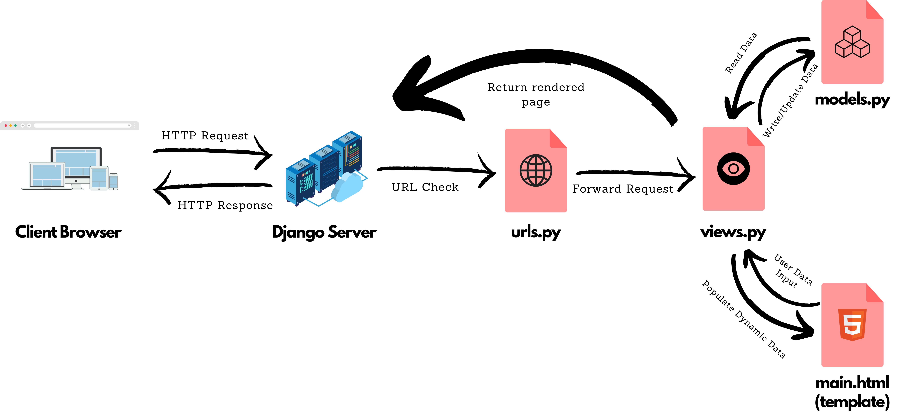
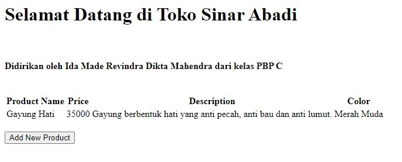
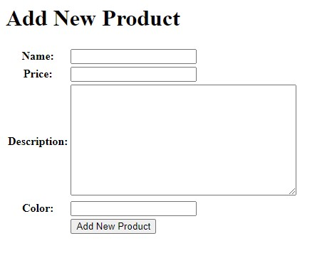
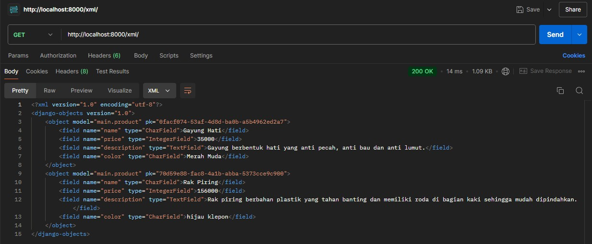

# Welcome to Toko Sinar Abadi
#### Website URL: http://ida-made-tokosinarabadi.pbp.cs.ui.ac.id/

---

## Checklist Implementation Process
>Tugas 2
1. Membuat repositori di GitHub dengan nama **`sinar-abadi-web`**.
2. Membuat repositori lokal di laptop saya dengan nama **`Tugas 2`**.
3. Menghubungkan repositori lokal dengan repositori online di GitHub.
4. Meng-install dependencies melalui `requirements.txt`:
    ```bash
    django
    gunicorn
    whitenoise
    psycopg2-binary
    requests
    urllib3
    ```
5. Memulai project menggunakan perintah:
    ```bash
    django-admin startproject mental_health_tracker
    ```
6. Memulai project baru di PWS dan melakukan deploy project di [website](http://ida-made-tokosinarabadi.pbp.cs.ui.ac.id/).
7. Mengubah bagian `ALLOWED_HOSTS` pada `settings.py` menjadi:
    ```python
    ALLOWED_HOSTS = ["localhost", "127.0.0.1", "http://ida-made-tokosinarabadi.pbp.cs.ui.ac.id/"]
    ```
8. Membuat aplikasi baru dengan nama **`main`**.
9. Membuat template dasar di file `main.html`.
10. Membuat model **`Product`** dengan atribut `name`, `price`, `description`, dan `color`.
11. Mengintegrasikan View dan Template dalam komponen Model-View-Template (MVT).
12. Mengonfigurasi URL di aplikasi **`main`** dan proyek secara keseluruhan.

## Visualisasi alur request/response


## Fungsi git dalam pengembangan perangkat lunak
'Git' merupakan sebuah Version Control System. 'Git' bukanlah satu-satunya Version Control System yang ada. Contoh lainnya adalah 'Helix Core'. Yang penting dalam pengembangan perangkat lunak ini adalah Version Control System ini. Version Control System sangat essential dalam workflow pengembangan perangkat lunak. Version Control System mendukung proses kerja sama dalam pengembangan perangkat lunak dengan memastikan setiap anggota tim dapat mengakses versi terbaru dari file yang telah dikerjakan juga oleh anggota lain dalam tim. Seluruh file ini akan dikumpulkan menjadi satu para repositori utama yang bertindak sebagai server.
Apabila kita ambil 'Git' sebagai contoh, 'Git' adalah sebuah Distributed Version Control System yang membuat setiap anggota dalam tim memiliki salinan dari projek (atau bagian dari projek) pada repositori lokal di perangkat mereka masing-masing. Kegunaan lain dari 'Git' juga kita bisa memonitor perkembangan dari proyek yang sedang dikembangkan. Versi lama dari proyek tersebut juga akan disimpan oleh 'Git' dan bisa kita akses kapan saja, bahkan bisa melanjutkan proyek dari versi itu saja.

## Mengapa framework Django dijadikan permulaan pembelajaran pengembangan perangkat lunak?
1. **Relatif Mudah Dipahami**: Django adalah sebuah framework yang berjalan dengan kode python. Python sekarang ini dikenal sebagai salah satu bahasa pemrograman yang paling mudah untuk dipelajari dan kerap menjadi bahasa pertama yang dipelajari oleh seseorang yang baru menyentuh dunia programming. Python pun menjadi salah satu bahasa yang paling mudah untuk dipahami karena syntax yang mudah untuk dicerna menggunakan logika awam manusia. Oleh karena itu, framework django akan menjadi lebih familier untuk dipelajari apabila seseorang ingin memulai pembelajaran pengembangan perangkat lunak, atau pengembangan aplikasi web secara spesifik, yang hanya membutuhkan pengetahuan yang cukup pada bahasa python.
1. **Community Support yang besar**: Django telah digunakan oleh banyak orang selama lebih dari 10 tahun. Dengan keberadaan yang sudah cukup lama tentunya akan membawa besarnya angka pengguna pula. Dari banyaknya pengguna inilah lahir Communiy Support yang besar bagi Django. Apabila seseorang mengalami kesulitan dalam mempelajari Django, dengan mencari informasi di Google saja sudah bisa menemukan banyak sekali referensi yang bisa menjadi solusi bagi kesulitan mereka

## Mengapa model pada Django disebut sebagai ORM?
Model di Django disebut sebagai ORM (Object-Relational Mapping) karena Django menyediakan cara untuk menghubungkan database relasional dengan kode Python menggunakan objek. Setiap tabel di database direpresentasikan sebagai kelas Python, dan setiap kolom dalam tabel adalah atribut dari kelas tersebut. ORM ini memungkinkan pengembang untuk berinteraksi dengan database menggunakan kode Python, tanpa perlu menulis query SQL secara langsung. ORM membantu mengelola data dengan lebih efisien dan mempermudah integrasi antara aplikasi dan database.

---
## Checklist Implementation Process
>Tugas 3
1. Saya memulai dengan men-deploy ulang projek django saya ke PWS dengan URL http://ida-made-tokosinarabadi.pbp.cs.ui.ac.id/
2. Mengimplementasi Skeleton menjadi kerangka views projek. Membuat template dengan file `base.html`.
    ```
    
    <!DOCTYPE html>
    <html lang="en">
        <head>
            <meta charset="UTF-8" />
            <meta name="viewport" content="width=device-width, initial-scale=1.0" />
             
        </head>

        <body>
             
        </body>
    </html>
    ```
3. Menerapkan UUID sebagai Primary Key dari Product
    ```python
    import uuid
    ...
    class Product(models.Model):
        id = models.UUIDField(primary_key=True, default=uuid.uuid4, editable=False)
    ```
4. Membuat input form dan display-nya
    | `main.html`    | `create_product.html` |
    |----------------|-----------------------|
    |  |  |
5. Memanmbahkan fungsi untuk melihat objek dalam format XML, JSON, XML by ID, dan JSON by ID
    - Menambahkan 4 fungsi views untuk menghandle request dan respose
        ```python
        # Format XML
        def show_xml(request):
            data = Product.objects.all()
            return HttpResponse(serializers.serialize("xml", data), content_type="application/xml")

        # Format JSON
        def show_json(request):
            data = Product.objects.all()
            return HttpResponse(serializers.serialize("json", data), content_type="application/json")

        # Format XML by ID
        def show_xml_by_id(request, id):
            data = Product.objects.filter(pk=id)
            return HttpResponse(serializers.serialize("xml", data), content_type="application/xml")

        # Format JSON by ID
        def show_json_by_id(request, id):
            data = Product.objects.filter(pk=id)
            return HttpResponse(serializers.serialize("json", data), content_type="application/json")
        ```
    - Melakukan URL routing untuk keempat views
        ```python
        from main.views import show_main, create_product, show_xml, show_json, show_xml_by_id, show_json_by_id
        ...
        urlpatterns = [
            ...
            path('xml/', show_xml, name='show_xml'),
            path('json/', show_json, name='show_json'),
            path('xml/<str:id>/', show_xml_by_id, name='show_xml_by_id'),
            path('json/<str:id>/', show_json_by_id, name='show_json_by_id'),
        ]
        ```

## URL view menggunakan `postman`
| Format | Screenshot |
| :----: | :----: |
| **XML** |  |
| **XML by ID** |  |
| **JSON** |  |
| **JSON by ID** |  |

## Mengapa kita memerlukan data delivery dalam pengimplementasian sebuah platform?
Data delivery menjadi elemen yang penting dalam pengimplementasian sebuah platform karena dengannya, aplikasi dapat menampilkan dan menyediakan informasi yang paling up-to-date. Data delivery juga dapat bermanfaat apabila platform tersebut dikembangkan dalam sebuah ekosistem. Data dapat dengan mudah diakses oleh berbagai layanan dalam ekosistem tersebut.

## Menurutmu, mana yang lebih baik antara XML dan JSON? Mengapa JSON lebih populer dibandingkan XML?
Terdapat beberapa hal yang menjadi kelebihan dari `JSON` jika dibandingkan dengan `xml':
- Tidak menggunakan *end tag* `</..>`
- Lebih ringan dan mudah dibaca oleh manusia
- Lebih efisien dalam hal ukuran data dan kecepatan parsing

Oleh karena itu, menurut saya `JSON` lebih baik daripada `XML`. Sebagai seorang manusia mencoba membaca keduanya sebenarnya juga sama-sama mudah, namun ketidakberadaan *end tag* pada `JSON` memberikan penulisan yang lebih rapi untuk dibaca.

Yang mungkin menjadi alasan akan popularitas `JSON` dibandingkan `XML` adalah efisiensinya secara *space* dan *runtime*. Dalam proses *parsing*, `XML` harus di-*parsing* menggunakan `XML Parser`.

## Jelaskan fungsi dari method `is_valid()` pada form Django dan mengapa kita membutuhkan method tersebut?
Method `is_valid()` pada form Django digunakan untuk memeriksa apakah data yang dikirimkan melalui form memenuhi semua kriteria validasi yang telah ditentukan sebelumnya. Method ini mengembalikan nilai boolean `True` atau `False`. Method ini dibutuhkan untuk memastikan bahwa data yang diterima oleh aplikasi adalah data yang benar dan sesuai dengan kriteria yang telah ditetapkan, sehingga bisa mencegah kesalahan dan masalah keamanan.

## Mengapa kita membutuhkan `csrf_token` saat membuat form di Django? Apa yang dapat terjadi jika kita tidak menambahkan `csrf_token` pada form Django? Bagaimana hal tersebut dapat dimanfaatkan oleh penyerang?
`csrf_token` digunakan untuk mencegah sebuah serangan bernama *Cross-Site Request Forgery* (CSRF). Serangan ini bekerja melalui `valid user` yang mendapatkan sesi yang valid pada sebuah halaman resmi. Penyerang akan membuat user tersebut mengakses sebuah situs yang ia buat untuk mendapatkan akses terhadap sesi dari user tersebut. Dalam sesi tersebut, peyerang dapat mengirimkan request tak diinginkan, melakukan transaksi yang tak diinginkan, hingga merubah data dalam situs web tersebut.

Dengan `csrf_token`, server akan memproses token ini terhadap user sebelum menjalankan seuatu transaksi yang menjamin keamanan dari user.


## Checklist Implementation Process
>Tugas 4
1. Membuat halaman untuk membuat akun baru
    ### New Account Page
    
    ### `new_account.html`
    ```
    

        
        <title>Buat Akun Baru</title>
        

        

        <div class="login">
            <h1>Buat Akun Baru</h1>

            <form method="POST">
                
                <table>
                {{ form.as_table }}
                <tr>
                    <td></td>
                    <td><input type="submit" name="submit" value="Buat akun" /></td>
                </tr>
                </table>
            </form>

            
            <ul>
                
                <li>{{ message }}</li>
                
            </ul>
            
        </div>

        
    ```
2. Membuat login page dan fungsi login serta logout.
    ### Login Page
    
    ### `login.html`
    ```
    

        
        <title>Login</title>
        

        
        <div class="login">
            <h1>Login</h1>

            <form method="POST" action="">
                
                <table>
                {{ form.as_table }}
                <tr>
                    <td></td>
                    <td><input class="btn login_btn" type="submit" value="Login" /></td>
                </tr>
                </table>
            </form>

            
            <ul>
                
                <li>{{ message }}</li>
                
            </ul>
             Don't have an account yet?
            <a href="">Create Account Now</a>
            </div>

        
    ```
    ### Logout Button
    
    
    ### `def user_logout(request)` in `views.py`
    ```
    def user_logout(request):
        logout(request)
        return redirect('main:login')
    ```

3. Menyesuaikan `views.py` untuk mengharuskan User untuk login sebelum bisa masuk ke halaman `main`.
    ```
    ...
    from django.contrib.auth.decorators import login_required
    ...

    ...
    @login_required(login_url='/login')
    def show_main(request):
    ...
    ```
    Dilakukan dengan memanfaatkan decorator `login_required` yang berfungsi mengharuskan User untuk login sebelum bisa mengakses halaman utama.

4. Menampilkan informasi waktu login terakhir pada halaman utama. **COOKIES** akan kita gunakan untuk mengadakan fitur ini.

    ### Fungsi `user_login` yang telah memanfaatkan data dari COOKIE
    ```
    def user_login(request):
    if request.method == 'POST':
        form = AuthenticationForm(data=request.POST)

        if form.is_valid():
            user = form.get_user()
            login(request, user)
            response = HttpResponseRedirect(reverse("main:show_main"))
            response.set_cookie('last_login', str(datetime.datetime.now()))
            return response

    else:
        form = AuthenticationForm(request)
    context = {'form': form}
    return render(request, 'login.html', context)
    ```
    ### Fungsi `user_logout` yang telah memanfaatkan data dari COOKIE
    ```
    def user_logout(request):
        logout(request)
        response = HttpResponseRedirect(reverse('main:user_login'))
        response.delete_cookie('last_login')
        return response
    ```

    ### Atribut baru `last_login` pada variabel `context` dalam fungsi `show_main`.
    ```
    'company' : 'Toko Sinar Abadi',
    'owner_name': 'Ida Made Revindra Dikta Mahendra',
    'owner_class': 'kelas PBP C',
    'store_products': store_products,
    'last_login': request.COOKIES['last_login'],
    ```

    ### Tampilan informasi last login
    

5. Meng-assign User kedalam setiap Product yang disimpan sebagai Foreign Key
    ### `models.py`
    ```
    ...
    class Product(models.Model):
        user = models.ForeignKey(User, on_delete=models.CASCADE)
    ...
    ```

    | User 1 View | User 2 View |
    | :---: | :---: |
    |  |  |

6. Migrasi dan Deployment
    ### Migrasi models
    ```
    python manage.py makemigrations
    python manage.py migrate
    ```

    ### Deployment menggunakan PWS pada [Website](http://ida-made-tokosinarabadi.pbp.cs.ui.ac.id/)
    

## Apa perbedaan antara HttpResponseRedirect() dan redirect()
| **HttpResponseRedirect** | **redirect** |
|--------------------------|--------------|
| ```from django.http import HttpResponseRedirect``` | ```from django.shortcuts import redirect``` |
| Argumen yang dibutuhkan adalah URL absolut. | Dapat menerima URL, nama view, atau objek model sebagai argumen. |

## Jelaskan cara kerja penghubungan model Product dengan User!
Fitur ini diimplementasikan dengan menggunakan `ForeignKey`. Dengan ini kita bisa menghubungkan Product dengan User dalam relasi **Many-to-One**. Dimana setiap produk dikaitkan dengan satu pengguna.

```
class Product(models.Model):
    user = models.ForeignKey(User, on_delete=models.CASCADE)
```

Dengan ini, setiap *Instance* dari Product akan menyimpan referensi ke suatu *Instance* dari User.

## Apa perbedaan antara authentication dan authorization, apakah yang dilakukan saat pengguna login? Jelaskan bagaimana Django mengimplementasikan kedua konsep tersebut.
| *Authentication* | *Authorization* |
| ---------------- | --------------- |
| Proses memverifikasi validitas identitas user. | Proses menentukan hak akses user. |
| Contoh: Memeriksa kebenaran username dan password. | Contoh: Menentukan apakah user dapat mengakses admin page. |
| Ketika seorang user login, proses *Authentication* dijalankan untuk memeriksa apakah data login tersebut valid menurut data User pada database. Proses ini diimplementasi melalui *built-in system* yang menyediakan model User dan *backend authentication*. | Ketika terbukti valid, proses *Authorization* akan dijalankan untuk menentukan apa yang diizinkan untuk dilakukan oleh user tersebut. Django mengimplementasi *permission* dan *groups* untuk menentukan peran yang diizinkan bagi user. |

## Bagaimana Django mengingat pengguna yang telah login? Jelaskan kegunaan lain dari cookies dan apakah semua cookies aman digunakan?
Django mengenali user yang berhasil login dengan menggunakan sesi dan cookies. Setiap kali user berhasil login, Django akan membuat sesi baru untuk user tersebut dan menyimpan informasi terkait sesi tersebut pada cookies di terminal si user. Sehingga, ketika user mengirimkan permintaan untuk dijalankan di server, cookies tersebut terkirimkan bersama permintaannya. Dengan demikian, Django dapat mengenali user yang berhasil login melalui cookies tersebut.

Ada beberapa kegunaan lain untuk cookies, seperti menyimpan preferensi user, melacak aktivitas user, dan menyimpan data, dll. Namun, tidak semua cookies yang biasa atau dibuat dan digunakan oleh webmaster aman. Mereka dapat diserang oleh Cross-Site Scripting (XSS) dan Cross-Site Request Forgery (CSRF). Oleh karena itu, penting untuk mengamankan cookies dan user cookies, dengan memberi atribut yang membuat cookies ini lebih aman, yaitu:

- HttpOnly: Mencegah akses cookies melalui JavaScript, mengurangi risiko serangan XSS.
- Secure: Memastikan cookies hanya dikirim melalui koneksi HTTPS, meningkatkan keamanan data.
- SameSite: Membatasi pengiriman cookies ke situs yang sama, membantu mencegah serangan CSRF.

## Checklist Implementation Process
>Tugas 5
1. Membuat fungsi edit dan delete pada product.

2. Menambahkan Tailwind CSS pada project

3. Meng-implementasi Navigation Bar untuk main page.

4. Meng-implementasi Tailwind CSS pada halaman-halaman project

## Jika terdapat beberapa CSS selector untuk suatu elemen HTML, jelaskan urutan prioritas pengambilan CSS selector tersebut!
CSS memiliki aturan prioritas yang menentukan selector mana yang akan diterapkan ketika ada beberapa selector yang cocok dengan elemen yang sama. Urutan prioritasnya adalah sebagai berikut:

1. **Inline Styles**: CSS yang ditulis langsung dalam atribut `style` pada elemen HTML memiliki prioritas tertinggi.
2. **ID Selectors**: Selector yang menggunakan ID (`#id`) memiliki prioritas lebih tinggi dibandingkan class atau elemen.
3. **Class, Attribute, and Pseudo-class Selectors**: Selector yang menggunakan class (`.class`), atribut (`[type="text"]`), dan pseudo-class (`:hover`) memiliki prioritas di bawah ID.
4. **Element and Pseudo-element Selectors**: Selector yang menggunakan nama elemen (`div`, `p`) dan pseudo-element (`::before`, `::after`) memiliki prioritas terendah.
5. **Universal Selector**: Selector universal (`*`) memiliki prioritas paling rendah.
6. **!important**: Deklarasi dengan `!important` akan mengesampingkan semua aturan lainnya, kecuali aturan lain yang juga menggunakan `!important`.

## Mengapa responsive design menjadi konsep yang penting dalam pengembangan aplikasi web? Berikan contoh aplikasi yang sudah dan belum menerapkan responsive design!
Responsive design penting karena memungkinkan aplikasi web untuk menyesuaikan tampilannya dengan berbagai ukuran layar dan perangkat, seperti desktop, tablet, dan ponsel. Ini meningkatkan pengalaman pengguna dan memastikan aksesibilitas yang lebih luas. Contoh aplikasi yang sudah menerapkan responsive design adalah Twitter dan GitHub, yang tampilannya menyesuaikan dengan baik pada berbagai perangkat. Sebaliknya, situs web yang tidak menerapkan responsive design mungkin terlihat baik di desktop tetapi tidak dapat digunakan dengan baik di perangkat mobile.

## Jelaskan perbedaan antara margin, border, dan padding, serta cara untuk mengimplementasikan ketiga hal tersebut!
- **Margin**: Ruang di luar elemen yang memisahkan elemen dari elemen lain. Dapat diatur menggunakan properti `margin`.
- **Border**: Garis yang mengelilingi elemen. Dapat diatur menggunakan properti `border`.
- **Padding**: Ruang di dalam elemen antara konten dan border. Dapat diatur menggunakan properti `padding`.

Contoh implementasi:
```css
.element {
    margin: 10px;
    border: 2px solid black;
    padding: 5px;
}
```

## Jelaskan konsep flex box dan grid layout beserta kegunaannya!
- **Flexbox**: Layout model satu dimensi yang digunakan untuk mengatur elemen dalam satu arah (baris atau kolom). Berguna untuk membuat layout yang fleksibel dan responsif.
- **Grid Layout**: Layout model dua dimensi yang memungkinkan pengaturan elemen dalam baris dan kolom. Berguna untuk membuat layout yang kompleks dan terstruktur.

Contoh implementasi Flexbox:
```css
.container {
    display: flex;
    justify-content: center;
    align-items: center;
}
```

Contoh implementasi Grid Layout:
```css
.container {
    display: grid;
    grid-template-columns: repeat(3, 1fr);
    grid-gap: 10px;
}
```

